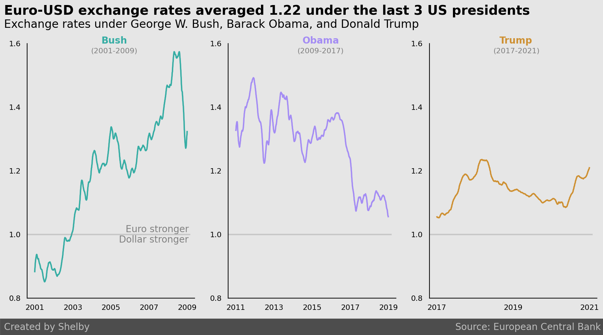

In this project, I used data from the European Central Bank (available [here](https://www.kaggle.com/lsind18/euro-exchange-daily-rates-19992020)) to visualize Euro-US Dollar (USD) exchange rates between the years of 2001 and 2021. Specifically, I visualized Euro-USD exchange rates during the last 3 US Presidents' terms:

A notebook containing code to generate the figure can be found [here](https://github.com/shelbybachman/exchange-rates/blob/main/exchange-rates.ipynb).
